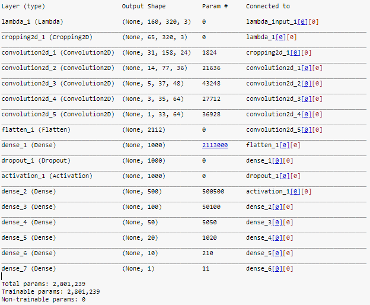

# **Behavioral Cloning** 

## Writeup Template

### You can use this file as a template for your writeup if you want to submit it as a markdown file, but feel free to use some other method and submit a pdf if you prefer.


**Behavioral Cloning Project**

The goals / steps of this project are the following:
* Use the simulator to collect data of good driving behavior
* Build, a convolution neural network in Keras that predicts steering angles from images
* Train and validate the model with a training and validation set
* Test that the model successfully drives around track one without leaving the road
* Summarize the results with a written report


[//]: # (Image References)

[image1]: ./examples/placeholder.png "Model Visualization"
[image2]: ./examples/placeholder.png "Grayscaling"
[image3]: ./examples/placeholder_small.png "Recovery Image"
[image4]: ./examples/placeholder_small.png "Recovery Image"
[image5]: ./examples/placeholder_small.png "Recovery Image"
[image6]: ./examples/placeholder_small.png "Normal Image"
[image7]: ./examples/placeholder_small.png "Flipped Image"

## Rubric Points
### Here I will consider the [rubric points](https://review.udacity.com/#!/rubrics/432/view) individually and describe how I addressed each point in my implementation.  

---
### Files Submitted & Code Quality

#### 1. Submission includes all required files and can be used to run the simulator in autonomous mode

My project includes the following files:
* model.py containing the script to create and train the model
* drive.py for driving the car in autonomous mode
* model.h5 containing a trained convolution neural network 
* writeup_report.md summarizing the results

#### 2. Submission includes functional code
Using the Udacity provided simulator and my drive.py file, the car can be driven autonomously around the track by executing 
```sh
python drive.py model.h5
```

#### 3. Submission code is usable and readable

The model.py file contains the code for training and saving the convolution neural network. The file shows the pipeline I used for training and validating the model, and it contains comments to explain how the code works.

### Model Architecture and Training Strategy

#### 1. An appropriate model architecture has been employed


My model consists of  5 convolution neural networks with 5x5 and 3x3 filter sizes, depths between 24 to 64 and 7 fully connected networks. The model includes RELU layers to introduce nonlinearity (code line 128-137), and the data is normalized in the model using a Keras lambda layer (code line 125). 


Below is the details of the Model:




My model is based on NVIDIA model which is suitable to this project and then i tuned few parameters and added extra layers. 


#### 2. Attempts to reduce overfitting in the model

The model contains dropout layer in order to reduce overfitting (model.py lines 142). 

The model was trained and validated on different data sets to ensure that the model was not overfitting. The model was tested by running it through the simulator and ensuring that the vehicle could stay on the track.

#### 3. Model parameter tuning

The model used an adam optimizer, so the learning rate was not tuned manually (model.py line 159).

#### 4. Appropriate training data

Training data was chosen to keep the vehicle driving on the road. I used a combination of center lane driving, recovering from the left and right sides of the road. For left and right images, I included the correction factor of 0.25 in the angle. 

For details about how I created the training data, see the next section. 

### Model Architecture and Training Strategy

#### 1. Solution Design Approach

The overall strategy for deriving a model architecture was as mentioned below:

I started with basic model with one convolution neural network and also added fully connected network. I used only the center images to train the model but it didnt worked well. Car was not able to drive on track.

Later I included preprocessing and augmentation. I cropped the images 70 pixels from the top and 25 pixels from the bottom. 
In the augmentation, I am randomly changing/reducing the brightness of the image. 

Then I referred NVIDIA model as my base and trained my model. Car was driving properly on straight line and the first curve. But the second and third curve, it was not working properly and not able to take the turn. I tried tuning few parameters and added dropout in the model, also included one more Fully connected network. 

Through the above, was able to see some changes but not as required. 

Later, I included the left and right images also with the correction factor in the angle and used all the images for training the model. Also, the augmented images. 


After the above, car was driving well autonomously around the track without leaving the road. 

#### 2. Final Model Architecture

The final model architecture (model.py lines ) consisted of a convolution neural network with the following layers.


#### 3. Creation of the Training Set & Training Process

To capture good driving behavior, I recorded two laps on track one using center lane driving. Here is an example image of center lane driving:


I then recorded the vehicle recovering from the left side and right sides of the road back to center so that the vehicle would learn to take turns accordingly during the curves. These images show what a recovery looks like :

#### Center Image


#### Left Image


#### Right Image


To augment the data sat, I did changes in the brightness. Below is an example image:

#### Original Image: 


#### Augmented Image:


When I trained the model using the sample dataset provided by Udacity, my model was working well and I didn't have to use the data which I generated. But in future, to improve the driving behavior and to make work for more number of laps I can use the generated dataset. 

I had 8036 number of data points.

I finally randomly shuffled the data set and put 20% of the data into a validation set. 

I used this training data for training the model. The validation set helped determine if the model was over or under fitting. The ideal number of epochs was 3. Tried with more number of epochs but the loss was increasing. I used an adam optimizer so that manually training the learning rate wasn't necessary.

